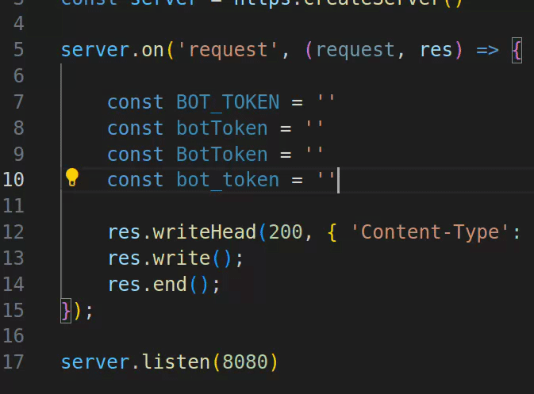

# Cursor Case Respect for VS code
### Skips more than the native one, respect nicely for casings.



## Features

Supports: camelCase, snake_case, kebab-case, PascalCase.

This extension contributes 4 commands, which 2 are bind to shortcuts per default:
- Move the cursor to the left/right next word, respecting variable casings
    - Left:  <kbd>Ctrl</kbd>+<kbd>Alt</kbd>+<kbd>Comma</kbd>
    - Right:  <kbd>Ctrl</kbd>+<kbd>Alt</kbd>+<kbd>Period</kbd>
    - Same as above, but respect punctuation such as: ```.``` ```,``` ```/``` ```:```. If you want to regularly use this version, update your shortcut bindings at  `Keyboard Shortcuts` <kbd>Ctrl</kbd>+<kbd>K</kbd>―<kbd>Ctrl</kbd>+<kbd>S</kbd> > `@ext:HeroProtagonist.respect-casings`


### 0.0.1

- Initial release


### to-do

- dry code
- support multiple cursors

**Enjoy!**
